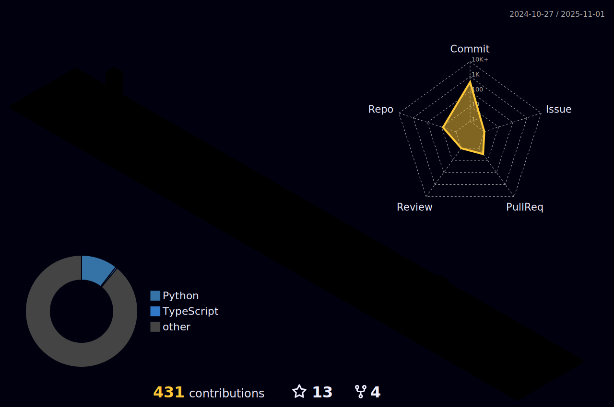

<div>

</div>
<br>

<a>
  
</a>

<h1 align="center">
  </a>&lt;𝙷𝚎𝚕𝚕𝚘 𝙲𝚘𝚍𝚎𝚛𝚜/&gt;!
    <p>
        I am <a href="https://metrics.lecoq.io/insights/khailas12"><b>Khailas <b><a target="_blank">
    </p> 
  </a>
  <br>
  <br>
</h1>

<summary>
  <h2 align="left">
    <b>About Me 😄</b>
  </h2>
</summary>

```javascript
const khailas = {
    personalBio: "I am a self-taught developer with a fervent passion for technology, working as a software engineer.",
    currentlyWorkingOn: [
        "Developing applications with AngularJs and Django REST",
        "Mastering database design principles with Postgresql",
        "Exploring the functionalities of ArangoDB, a NoSQL database."
    ],
    architecture: ["Microservices", "RESTful APIs", "MVC", "ORM", "Client-Server"],
    askMeAbout: ["Web Development", "Technology", "Movies & TV Shows", "Music"],
    hobbies: ["Playing Guitar", "Listening and Creating rhythmic music", "Journaling"],
    funFact: "Programming: where forgetting a semicolon turns a masterpiece into a mess.",
    favoriteQuote: "The only way to do great work is to love what you do. - Steve Jobs"
};
```

<summary>
  <h2 align="left">
    <b>Stay Connected</b>
    <a target="_blank">
      
    </a>
  </h2>
</summary>


[](https://www.linkedin.com/in/khailas12/) [](https://mail.google.com/mail/u/0/#search/rfc822msgid%3Akhailas303%40gmail.com) [](https://wakatime.com/@khailas12) [](https://metrics.lecoq.io/insights/khailas12)
<br>


<h2 align="center">
    <b>Languages and Tools💻</b>
  </a>
</h2>


<a target="_blank"></a>

<a href="https://www.python.org" target="_blank"></a>
<a href="https://www.djangoproject.com/" target="_blank">  </a>
<a href="https://www.django-rest-framework.org/" target="_blank">  </a>
<a href="https://angular.io/" target="_blank">  </a>
<a href="https://nodejs.org/en/" target="_blank">  </a>
<a href="https://www.typescriptlang.org/" target="_blank">  </a>
<a href="https://getbootstrap.com/" target="_blank">  </a>
<a href="https://html.com/" target="_blank">  </a>
<a href="https://www.w3.org/Style/CSS/Overview.en.html" target="_blank">  </a>
<a href="https://www.postgresql.org/" target="_blank">  </a>
<a href="https://dbeaver.io/" target="_blank">  </a>
<a href="https://arangodb.com/" target="_blank">  </a>
<a href="https://www.mongodb.com/" target="_blank">  </a>
<a href="https://sqlitebrowser.org/" target="_blank">  </a>
<a href="https://git-scm.com/" target="_blank">  </a>
<a href="https://github.com/" target="_blank">  </a>
<a href="https://www.gnu.org/software/bash/" target="_blank">  </a>
<a href="https://opencv.org/" target="_blank">  </a>
<a href="https://dashboard.heroku.com/login" target="_blank">  </a>
<a href="https://www.postman.com/" target="_blank">  </a>
<a href="https://code.visualstudio.com/" target="_blank">  </a>
<a href="https://www.office.com/" target="_blank">  </a>
<a href="https://www.atlassian.com/software/jira/" target="_blank">  </a>
<a href="https://www.microsoft.com/software-download/windows11/" target="_blank">  </a>
<a href="https://ubuntu.com/" target="_blank">  </a>
<a href="https://www.npmjs.com/" target="_blank">  </a>
<br>
<br>

<br>
<summary>
  <h2 align="left">
      <b>Github Stats</b>
    </a>
    
  </h2>
</summary>

<p align="center">
  <a>
    
    
    
  </a>
<br>
</p>

 


<summary>
  <h2 align="left">
  <b>Coding Stats</b> 
    </a>
  
  </h2>
</summary>

<!--START_SECTION:waka-->

```txt
Python       43 hrs 27 mins  ████████████████████████▓   98.73 %
TypeScript   30 mins         ▒░░░░░░░░░░░░░░░░░░░░░░░░   01.15 %
Makefile     2 mins          ░░░░░░░░░░░░░░░░░░░░░░░░░   00.10 %
HTML         0 secs          ░░░░░░░░░░░░░░░░░░░░░░░░░   00.01 %
Bash         0 secs          ░░░░░░░░░░░░░░░░░░░░░░░░░   00.01 %
```

<!--END_SECTION:waka-->


<summary>
  <h2 align="left">
    <b>Time Status</b>
  <g-emoji class="g-emoji" alias="chart_with_upwards_trend" fallback-src="https://github.githubassets.com/images/icons/emoji/unicode/1f4c8.png">📈</g-emoji>
  </h2>
</summary>

<a href="https://wakatime.com/@27124313-d737-4f80-b278-de0b3cc3d858"></a>

<p align="center">
  <a href="https://wakatime.com/@27124313-d737-4f80-b278-de0b3cc3d858">
    
  </a>
  <a href="https://wakatime.com/@27124313-d737-4f80-b278-de0b3cc3d858">
    
  </a>
</p>

<summary>
  <h2 align="left">
      <b>📊Metrics</b> 
    </a>
  </h2>
</summary>
<div align="center">
  
  

</div>


<summary>
  <h2 align="left">
      <b>My Contributions</b> 
    </a>
  </h2>
</summary>



<!-- Don't Run Contribution Graph(Generate Snake) Action on your default Branch-->

<!-- Don't Run Contribution Graph(Generate Snake) Action on your default Branch -->

[](https://github.com/Khailas12/github-readme-activity-graph)

<div align="center">
  
</div>

